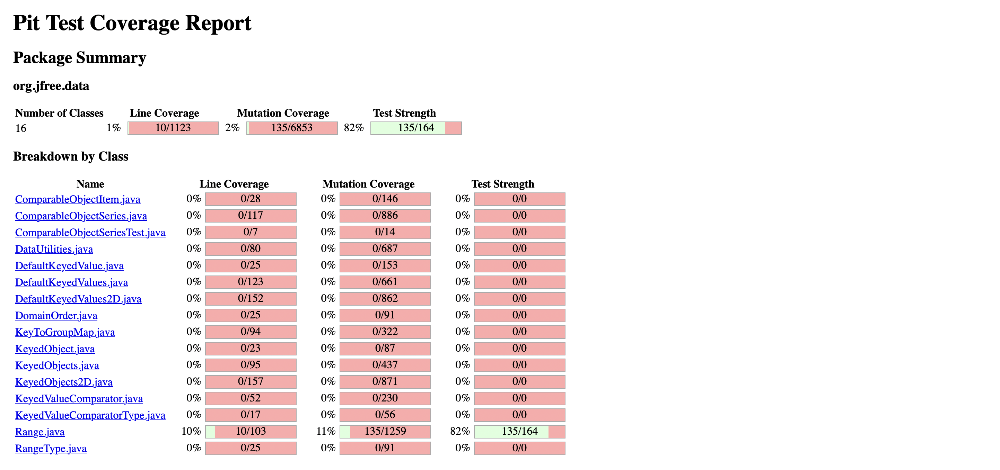

<!-- Output copied to clipboard! -->

<!-----

Yay, no errors, warnings, or alerts!

Conversion time: 1.029 seconds.

Using this Markdown file:

1. Paste this output into your source file.
2. See the notes and action items below regarding this conversion run.
3. Check the rendered output (headings, lists, code blocks, tables) for proper
   formatting and use a linkchecker before you publish this page.

Conversion notes:

* Docs to Markdown version 1.0β33
* Mon July 31 2023 21:34:05 GMT-0700 (PDT)
* Source doc: SENG 637 Assignment 4 Report
* Tables are currently converted to HTML tables.
----->

**SENG 637 GROUP 3**

<table>
  <tr>
   <td>
    Sr.
   </td>
   <td>
    Name
   </td>
  </tr>
  <tr>
   <td>
    1.
   </td>
   <td>
    Raiyan Kabir
   </td>
  </tr>
  <tr>
   <td>
    2.
   </td>
   <td>
    Jay Gurjar
   </td>
  </tr>
  <tr>
   <td>
    3.
   </td>
   <td>
    Rahul Jha
   </td>
     <tr>
        <td>
           4.
        </td>
      <td>
         Usman Zia
      </td
    </tr>
      <tr>
         <td>
            5.
         </td>
         <td>
            Tyler Shenassa
         </td>
      </tr>
  </tr>
</table>

**Introduction**

In this lab, we performed mutation using the pitest functionality provided in Eclipse. We first used assignment three unit tests to get a baseline understanding of the mutants we have. In this assignment, we added more unit tests with the goal of eliminating some of the mutants present. We also explored GUI testing using selenium and sikulix.

# Analysis of 10 Mutants of the Range class 

**Mutant 1: contains()**

This produced a mutant of org/free/data/chart/util/Parahecks::nullNotPermitted

Status: Killed

Analysis: The test in RangeTest.java which tested null objects deals with the null Mutant created by PIT, showing the null mutant has been killed. 

**Mutant 2: constrain()**

This test produced a mutant when positive infinity was passed to the constrain method. 

Status: Killed

Analysis: The test in RangeTest.java which tested if PositiveInfinity is in range of (-1,1) covers the mutant created by PIT. And therefore, the Positive infinity mutant gets handled by this test case.

**Mutant 3: getCentralValue()**

The mutant changed lower from 2 to 1.

Status: Killed

Analysi: The test suite tested values between -1 and 1, and therefore this mutant was killed by the original test suite. The mutant generated only changed initial values and therefore, the mutant gets killed/handled. 

**Mutant 4: getLowerBound()**

 This mutant replaces the return value with 0.0 instead of the lowerBound.

Status: Killed 

This mutant was killed with our original test suite as we had a test for the function getLowerBound() with the range -1,1. By returning 0.0 our test caught it as we were expecting it to return -1.

**Mutant 5: combine()**

The mutant replaces 1.3 to 5. 

Status: Killed

The mutant generated by PIT is handled by our original test suite since the value PIT changed to is also a double. And therefore, it kills the mutant which was generated. 

**Mutant 6: geaterThanToLessOrEqual**

This mutant changes the boolean return from 'return (value >= this.lower && value &lt;= this.upper);' to 'return (value &lt;= this.lower && value &lt;= this.upper).

Status: Killed

Analysis:  This mutant will be killed by our test case that has a range of -1 to 1 with a value equal to 0 because originally this return will be true but with the mutant value &lt;= this.lower will be false. Since the mutant will be false and not the expected truth it will be killed.

**Mutant 7: negated conditional **

This mutant will negate the allowZeroCrossing boolean. i.e if the boolean is false it will make it true and vice versa. 

Status: Survived

Analysis: Since we did not test the shift function extensively this mutant was not killed.

**Mutant 8: equal**

The mutant in DataUtilities returns true even though it is false. 

Status: Killed

Analysis: This mutant is killed by designing a test case which purposely uses a broken array. First array is {1,2,3,4,5,6} and the second array is {1,2,3,4},{5,6}. 

# Mutant 9: calculateRowTotal

The mutant in DataUtilities returns false when it should not be able to run with a null value.

Status: Survived

Analysis: We created a test case to handle a null object, however this returned an IllegalArgumentException and did not kill the mutant.

# Mutant 10: createNumberArray

The mutant in DataUtilities would return true when two arrays are unequal.

Status: Killed

Analysis: Created a test case where we tested two equal arrays. We then check the Number object from createNumberArray with expected output.

# Report all the statistics and the mutation score for each test class

Our range test initially had 42% mutation coverage. 

After adding test cases, we increased Range mutation coverage to 54%.

Our initial DataUtilites had 44% mutation coverage.

.PNG)

After adding test cases, we increased mutation coverage to 56%.

# Analysis drawn on the effectiveness of each of the test classes 

Range test was moderately effective from lab 3 and therefore, we had to increase our test coverage to kill more mutants. This increased our coverage and we used a similar approach to this in DataUtilies which helped us increase our coverage from 44% to 56%. We were able to increase our mutation coverage by testing methods that we didn’t cover and also by covering all the branches. Also, many of the unresolved mutants in RangeTest and DataUtilitesTest were equivalent mutants that cannot be removed. 

# A discussion on the effect of equivalent mutants on mutation score accuracy 

In the Range class, for instance, there are equivalent mutants that impact the score mutation coverage score and make it much lower. Equivalent mutants make it so that some code that is being tested could have a greater mutation score than Pitclipse shows. Some mutations are not detectable through test cases. For example, post incrementation of returned value does not affect the production of the code and thus won't be caught, leading to lesser accurate mutation scores. 

Equivalent mutants and unreachable mutants that do not change anything and can't be killed can reduce the accuracy of the test cases. Also, it makes it more challenging to eliminate all the different mutations to reach a perfect score for any given class. Since every class will have a form of mutations that cannot be killed, the goal threshold should be lowered from the ideal 100% to better show the quality of tests and reflect reality.

**Detecting equivalent mutants **

Equivalent mutants were identified by analyzing the surviving mutants and checking if the mutant is the equivalent in the original code. A common one was incrementing of a return variable which was the same as the original code. 

# A discussion of what could have been done to improve the mutation score of the test suites

We developed test cases so the mutations could be killed. Through developing such tests we were able to increase the mutation test score. A common source of mutations was from boundary testing as well as the variables found in the complex decision statements where multiple decisions were nested. To further improve the mutation test score, more tests can be added for the boundary and nested decision statements to ensure the most number of mutations are killed. 

# Why do we need mutation testing? Advantages and disadvantages of mutation testing

Further verification of the test suite. It allows for external changes to code that shows the tests can handle such external changes through bug injection. If the test suite can identify the new bugs injected, it shows that the test suite is robust and effective. 

Some advantages of mutation include

* A way to measure the quality of the test cases written
* Find if test suite can handle bug injection
* A way to know that the testing is robust enough and can stop testing further
* Shows a way to know to what extent the SUT has been tested and allows for comprehensive results

Disadvantages of mutation testing include: 

1. The testing is complex and takes time to complete 
2. To write the test, knowledge is needed about the original code
3. It takes time to run the tests and also analysis of it also takes a lot of time

# Explain your SELENIUM test case design process 

We selected two different websites which were [https://bestbuy.ca/](https://bestbuy.ca/) and [https://walmart.ca/](https://walmart.ca/) and then identified the important functionalities and finally writing the tests for verification of the system working as intended. 

Functionalities explored were:

1. Test For Searching products
    1. Searching for an existing product
    2. Searching for non-existing product
2.  Tests for adding products to the cart
    3. Adding one product to a cart
    4. Adding multiples quantities of a product
3.  Testing features in BestBuy.com
    5. Logging in with a non existent account, returns warning message
    6. Tested the filters. Reduced the amount of inventory available after applying filters
4. Cart Checkout for BestBuy.com
    7. Checking out an empty cart, returns empty message and image
    8. Checking out a cart with multiple items. Successfully goes to the payment page.

# Explain the use of assertions and checkpoints how did you test each functionality with different test data

Assertions were used to ensure that the expected outcomes match the actual value and that the end is in the correct state. The checkpoints were used for when a longer path was taken and that the path is correct before running the specified test. Checkpoints were used to verify the loading of the pages, testing different web page functionality and the end state. 

# How did you test each functionaity with different test data

There were many individual test cases that each had different data. For instance, some had null or NaN for the data. Also parameterized testing that allowed us to write the test data efficiently. 

# Discuss advantages and disadvantages of Selenium vs. Sikulix

Selenium can work with more languages such as Java that work with Junit Tests to develop a full test suite. Selenium’s IDE was also easier to work with and understand as compared to Sikulix. An advantage of Skiulix over selenium is how easy it is to take screenshots. 

# Teamwork/effort division

We decided that two of us would be on the Range and the rest would work on Data Utilities. Everyone ran the selenium tests through. Each pair of teams completed the code coverage for each section. We then wrote added test cases to get the desired coverage. Each team later checked on each other to ensure the test cases were satisfactory and we also asked each other questions throughout the process. 

# Difficulties Encountered

Developing unit tests to get high code coverage. Also setting up the lab was difficult.

# Lessons Learned

We learned how to increase mutation coverage and understand the different mutations that can occur. We also learned how to write efficient test cases that will kill such mutations.

# Comments and Feedback

In the lab, we got the chance to learn more about different methods of code coverage test cases and how it's important to have good test coverage especially. All in all, an interesting lab to do. 
